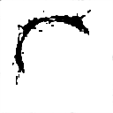
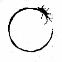
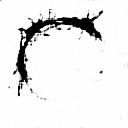

# Generative-Adversarial-Networks
How to make a Video using group of images using GAN's

Run main.py to Train the Networks over the training examples.

Open the folder Location to see the generated images.

